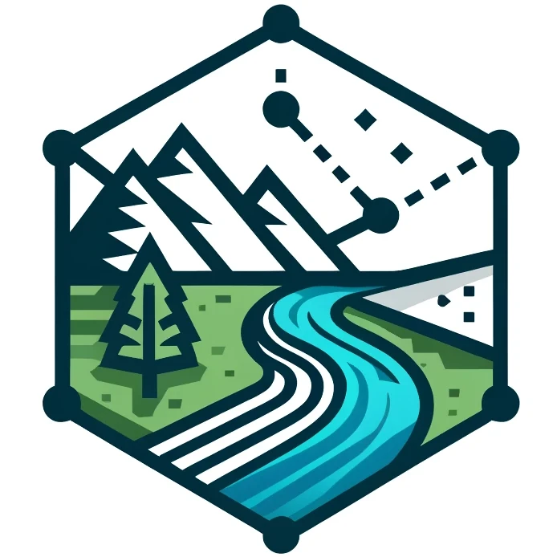

  
  <h1>Watershed</h1>

A system for automatically calculating the watershed catchment from a set of coordinates.

Leverages digital elevation models (DEMs) accessed via [OpenTopography](https://opentopography.org/).

Outputs KML & GeoJson files, useful for importing into other tools.

Tries to integrate with [CalTopo](https://caltopo.com/) (e.g. importing initial coordinates, automatically load exported kml).

DEMs currently supported:

* [USGS10m 1/3 arc-second](https://portal.opentopography.org/datasetMetadata?otCollectionID=OT.012021.4269.1]) (covers ~USA)
* [USGS30m 1 arc-second](https://portal.opentopography.org/datasetMetadata?otCollectionID=OT.012021.4269.2) (covers ~North America)

Coverage maps on the respective pages linked above.

