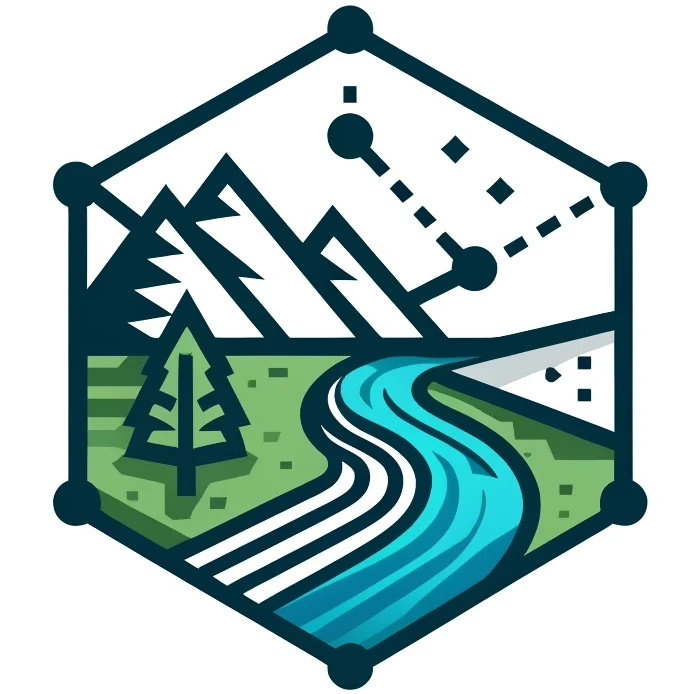

<p align="center">
  
  <h1>Watershed</h1>
</p>
<p>

A system for automatically calculating the watershed catchment from a set of coordinates.

Leverages digital elevation models (DEMs) from [USGS 3DEP](https://www.usgs.gov/3d-elevation-program), fetched directly from the National Map ImageServer.

Outputs KML & GeoJson files, useful for importing into other tools.

Tries to integrate with [CalTopo](https://caltopo.com/) (e.g. importing initial coordinates, automatically load exported kml).

DEMs currently supported (both via USGS 3DEP, US coverage):

* `USGS10m` — 1/3 arc-second (~10 m/px)
* `USGS30m` — 1 arc-second (~30 m/px)
</p>

## Running as a systemd user service

A `watershed.service` unit file is included for running under systemd as a user service.

```bash
mkdir -p ~/.config/systemd/user
cp watershed.service ~/.config/systemd/user/
systemctl --user daemon-reload
systemctl --user enable --now watershed
```

View logs with `journalctl --user -u watershed -f`.

The unit assumes the repo is checked out at `~/watershed` with a venv at `~/watershed/venv`.
